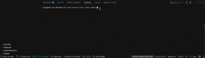
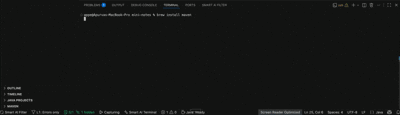
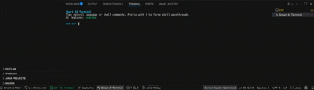

# Smart AI Terminal & logs Filter

**Filter the noise. Command in plain English.**

Smart AI Terminal & logs Filter is a VS Code extension with two core superpowers: it **automatically filters terminal output** so you only see errors, warnings, and your own logs and it gives you an **AI Smart Terminal** where you type plain English and get shell commands, confirmed and executed instantly.

---

## Why you need this

**The noise problem:** Every time you run `npm start`, `python manage.py runserver`, or `docker compose up`, your terminal floods with hundreds of lines you never asked for Next.js banners, webpack progress bars, Spring Boot ASCII art, npm install logs. The one actual error that matters is buried somewhere in the middle.

**The command problem:** You know what you want to do - *"clear npm cache and reinstall dependencies"*, *"kill the process on port 3000"*, *"show me disk usage by folder"* - but you have to stop and look up the exact syntax. Every time.

Smart Terminal Filter solves both. Zero configuration required.

---

## Features

### AI Smart Terminal
A custom terminal that understands plain English. Open it with `Cmd+Shift+I`or by clicking on the icon below on status bar, describe what you want, and the AI translates it into the exact shell command for your platform and shell with a confirmation step before anything runs.

```
ask ai> kill the process running on port 3000
Thinking...

Suggested command:
  $ lsof -ti:3000 | xargs kill -9
  Finds and kills the process currently listening on port 3000

Run? [y]es / [n]o / [e]dit:
```

- **Destructive command detection**: `rm`, `DROP TABLE`, `truncate`, and similar commands get a bold red warning before execution
- **Shell passthrough**: prefix with `!` to bypass AI and run directly (e.g. `!./deploy.sh`)
- **Edit before running** : type `e` at the confirmation prompt to drop the command into the input line for editing
- **Context-aware**: uses your platform, detected shell, working directory, and last 5 commands as context
- **Ctrl+C** cancels a running command or dismisses a pending confirmation
- **`?` or `help`** shows an in-terminal reference
- Falls back to a plain terminal if no API key is configured

### Intelligent Noise Filtering
Automatically hides framework boilerplate and build system noise across **8 frameworks** and **10+ languages** while keeping errors, warnings, and your own `console.log` output front and center. Up to 95% of irrelevant output is hidden at the default verbosity level.

### Verbosity Control
A single slider in the panel gives you 5 levels of detail:

| Level | What you see |
|---|---|
| 1 | Errors + your console.log / print output only |
| 2 | + Warnings and deprecation notices *(default)* |
| 3 | + Server status messages and build results |
| 4 | + Verbose / info-level output |
| 5 | Everything — raw, unfiltered |

### Command Status Banner
A persistent banner at the top of the panel always shows the current state of your terminal:

| State | Meaning |
|---|---|
| ○ Waiting | No terminal output yet |
| ↻ Running | Command is running, no errors so far |
| ✓ Success | Completed with no errors |
| ⚠ Warning | Completed with warnings |
| ✗ Error | Errors detected - action needed |

### Stack Trace Grouping
Multi-line stack traces are collapsed into a single expandable block showing the error message, frame count, and source file. Click the block to expand all frames. Click **→ Go to line** to jump directly to the error location in your code.

### Error Trend Detection
If the same error appears multiple times across runs it gets a repeat badge - **↻ 2nd time**, **↻ 3rd time** - so recurring problems are immediately obvious. The first occurrence is retroactively hidden and replaced by the latest one with the badge.

### Flash + Toast Notifications
When new errors hit the terminal:
- The status bar **flashes red** three times
- A **toast notification** appears: *"Smart Terminal: N errors detected in terminal output"* with an **Open Smart Terminal** action button
- Toast notifications are debounced to at most one per 5 seconds

### Error Sound Alert
When a terminal command fails with errors, an audio alert plays automatically - so you know something went wrong even when the terminal is off-screen. Disable with `smartTerminal.errorSound: false`.

### Framework Auto-Detection
Detects your project type from `package.json`, `manage.py`, `pom.xml`, `go.mod`, and other config files, then applies the right noise/signal rules automatically. Supported:

- Next.js / React (CRA + Vite)
- Express / Node.js
- Django / Python
- Spring Boot / Java
- Ruby on Rails
- Docker / Docker Compose
- Go

### Custom Patterns
Add your own regex patterns to always hide or always show specific output:

```json
"smartTerminal.customNoisePatterns": ["^\\[HMR\\]", "^webpack compiled"],
"smartTerminal.customSignalPatterns": ["payment", "order.*created"]
```

### AI-Powered Panel Tools *(requires API key)*
Three AI buttons live inside the filtered log panel:

- **Explain Error**: plain-English breakdown of what went wrong, the root cause, a suggested fix, and a corrected code snippet. Reads up to 10 lines of source context around the error location automatically.
- **Summarize**: 2–3 sentence TL;DR of the entire run: outcome, error count, warnings, and key events as bullet points.
- **Ask**: natural language search through all captured log lines. Type *"slow database queries"* or *"what caused the crash?"* and get matching lines plus a conversational answer.

### Standalone CLI - `smartlog`
Filter logs outside VS Code by piping through `smartlog`:

```bash
npm start | smartlog
python app.py | smartlog -v 3
docker logs -f my-container | smartlog -e
go run . 2>&1 | smartlog --summary
cat build.log | smartlog -q "database errors" --json
```

---

## Status Bar Buttons

After installation, five items appear in the VS Code status bar (bottom-left):

| Button | What it shows | Click action |
|---|---|---|
| **○ Smart Terminal** | Command status icon - idle / running / success / warning / error. Background turns red on error, yellow on warning, green on success. Flashes red when new errors are detected. | Opens the filtered log panel |
| **$(filter) L2: +Warnings** | Current verbosity level | Opens a quick-pick to change verbosity (1–5) |
| **$(error) 3  $(output) 15/200  $(eye-closed) 185 hidden** | Error count, warning count, visible vs. total lines, noise hidden. Background matches severity. | Opens the filtered log panel |
| **$(debug-start) Capturing** | Whether log capture is active. Shows **Paused** with a yellow background when paused. | Toggles capture on / off |
| **$(sparkle) AI Smart Terminal** | Always visible. One-click access to the AI Smart Terminal. | Opens the AI Smart Terminal |

---

## Smart AI Logs Filter Demo

### Error Detection


### Success State



## Smart AI Terminal Demo


---

## Installation

### From the VS Code Marketplace *(recommended)*

1. Open VS Code
2. Press `Cmd+Shift+X` (Mac) / `Ctrl+Shift+X` (Windows/Linux) to open Extensions
3. Search **Smart Terminal Filter**
4. Click **Install**

The extension activates automatically on startup — no configuration required.

### Manual Installation via VSIX

1. Download the `.vsix` file from the [GitHub Releases](https://github.com/Apurvashelar/smart-terminal-filter/releases) page
2. Open VS Code
3. Press `Cmd+Shift+P` → **Extensions: Install from VSIX...**
4. Select the downloaded `.vsix` file
5. Reload VS Code when prompted

### Install from Source

```bash
git clone https://github.com/Apurvashelar/smart-terminal-filter
cd smart-terminal-filter
npm install
npm run build
npm run package        # produces smart-terminal-filter-pro-x.x.x.vsix
```

Then install the generated `.vsix` via **Extensions: Install from VSIX...** as above.

---

## Opening the Filtered Log Panel

| Method | Action |
|---|---|
| Keyboard shortcut | `Cmd+Shift+L` (Mac) / `Ctrl+Shift+L` (Windows/Linux) |
| Status bar | Click any of the first four status bar items |
| Command Palette | `Cmd+Shift+P` → **Smart Terminal: Open Filtered Log Panel** |

The panel docks alongside your terminal. Run any command and filtered output appears immediately.

---

## Opening the AI Smart Terminal

| Method | Action |
|---|---|
| Keyboard shortcut | `Cmd+Shift+I` (Mac) / `Ctrl+Shift+I` (Windows/Linux) |
| Status bar | Click **$(sparkle) AI Smart Terminal** |
| Command Palette | `Cmd+Shift+P` → **Smart Terminal: Open AI Terminal** |

Type natural language or shell commands at the `ask ai>` prompt. Type `?` for a full command reference.

---

## Setting Up AI Features

AI features - Explain Error, Summarize, Ask, and the AI Smart Terminal - require an API key from Claude (Anthropic), OpenAI, or a locally running Ollama instance. Your key is stored in the **OS keychain** (macOS Keychain / Windows Credential Manager) never in any settings file or on disk.

### Step 1: Choose your provider

Open VS Code Settings (`Cmd+,`) and set:

```
smartTerminal.ai.provider → claude   (or openai / ollama)
```

### Step 2: Add your API key

Open the Command Palette (`Cmd+Shift+P`) and run:

```
Smart Terminal: Set AI API Key
```

A secure password input box appears. Paste your key and press Enter.

**Where to get API keys:**
- **Claude**: [console.anthropic.com](https://console.anthropic.com) → API Keys
- **OpenAI**: [platform.openai.com/api-keys](https://platform.openai.com/api-keys)
- **Ollama**: No key needed — set provider to `ollama` and make sure Ollama is running locally (`ollama serve`)

### Removing your API key

Run `Smart Terminal: Clear AI API Key` from the Command Palette.

---

## Panel Controls Reference

| Control | Description |
|---|---|
| Search box | Live filter with regex support. Highlights matching text in results. |
| V: slider | Verbosity level 1–5. Drag to change; panel re-renders instantly. |
| Level dropdown | Filter by level: All / Errors / Warnings / My logs / Status |
| Clear | Clears all captured logs and resets stats |
| Export | Opens all visible filtered lines in a new editor tab as a `.log` file |
| **Explain Error** | Sends the last error + stack trace + source context to AI for analysis |
| **Summarize** | Generates a TL;DR of the entire captured run |
| **Ask** input + button | Natural language search: type a question and press Ask or Enter |
| → Go to line | Appears on error lines and stack frames. Click to jump to the exact file and line in the editor. |
| Stack trace block | Click to expand/collapse the full stack trace. Always shows the error message and frame count when collapsed. |

---

## All Commands

| Command | Shortcut | Description |
|---|---|---|
| `Smart Terminal: Open Filtered Log Panel` | `Cmd+Shift+L` | Open the filtered log panel |
| `Smart Terminal: Open AI Terminal` | `Cmd+Shift+I` | Open the AI Smart Terminal |
| `Smart Terminal: Clear All Logs` | — | Clear the log view |
| `Smart Terminal: Toggle Log Capture` | — | Pause / resume capturing terminal output |
| `Smart Terminal: Set Verbosity Level` | — | Pick verbosity 1–5 via quick pick |
| `Smart Terminal: Export Filtered Logs` | — | Open filtered logs in a new editor tab |
| `Smart Terminal: Set AI API Key` | — | Securely save your API key to the OS keychain |
| `Smart Terminal: Clear AI API Key` | — | Remove the stored API key |
| `Smart Terminal: AI — Explain Last Error` | — | AI explanation of the most recent error |
| `Smart Terminal: AI — Summarize Recent Logs` | — | AI summary of the current run |

---

## Configuration Reference

| Setting | Default | Description |
|---|---|---|
| `smartTerminal.verbosityLevel` | `2` | Verbosity level 1–5 |
| `smartTerminal.autoOpen` | `true` | Auto-open panel when terminal output is detected |
| `smartTerminal.maxLogLines` | `5000` | Max lines retained in memory |
| `smartTerminal.frameworkDetection` | `true` | Auto-detect project framework and apply tuned presets |
| `smartTerminal.collapseStackTraces` | `true` | Collapse stack traces into expandable blocks |
| `smartTerminal.highlightUserLogs` | `true` | Highlight console.log / print statements |
| `smartTerminal.errorSound` | `true` | Play an audio alert when errors are detected |
| `smartTerminal.customNoisePatterns` | `[]` | Regex patterns to always hide |
| `smartTerminal.customSignalPatterns` | `[]` | Regex patterns to always show |
| `smartTerminal.ai.provider` | `claude` | AI provider: `claude`, `openai`, or `ollama` |
| `smartTerminal.ai.model` | *(provider default)* | Override the model name |
| `smartTerminal.ai.baseUrl` | *(provider default)* | Custom base URL for Ollama or API proxies |
| `smartTerminal.aiTerminal.confirmBeforeExecute` | `true` | Show `[y/n/e]` confirmation before running AI-generated commands |
| `smartTerminal.aiTerminal.showExplanation` | `true` | Show plain-English explanation alongside generated commands |

---

## CLI Reference — `smartlog`

Build from source (`npm run build`), then pipe any command through it:

```bash
npm start | smartlog
python app.py 2>&1 | smartlog -v 3
docker logs -f container | smartlog -e
go run . 2>&1 | smartlog --summary
cat build.log | smartlog -q "authentication failures" --json
```

| Flag | Description |
|---|---|
| `-v, --verbosity <1-5>` | Verbosity level (default: 2) |
| `-e, --errors-only` | Shortcut for `-v 1` — errors and console output only |
| `-r, --raw` | Shortcut for `-v 5` — unfiltered raw output |
| `-s, --summary` | Print a stats summary after all input is processed |
| `-q, --query <text>` | Natural language keyword filter (e.g. `"slow queries"`) |
| `--no-color` | Disable ANSI color codes in output |
| `--json` | Output each visible line as a JSON object (one per line) |
| `-h, --help` | Show help |

Output lines are prefixed with level badges: `[ERR]`, `[WRN]`, `[USR]`, `[STS]`, `[INF]`, `[DBG]`.

---

## Languages & Frameworks Supported

**Noise filtering for:** JavaScript, TypeScript, Python, Ruby, Java, Go, Rust, C#, PHP, Docker

**Stack trace detection for:** Node.js, Python, Ruby, Java, Go, Rust, C#, PHP

**Framework presets for:** Next.js, React (CRA/Vite), Express, Django, Spring Boot, Rails, Docker, Go

---

## Privacy

- Your logs never leave your machine unless you explicitly use an AI feature
- AI features send only the relevant error lines, stack trace, and up to 10 lines of source context to the API — not your full log history
- API keys are stored in the OS keychain, never in VS Code settings or any file on disk

---

## License

MIT
